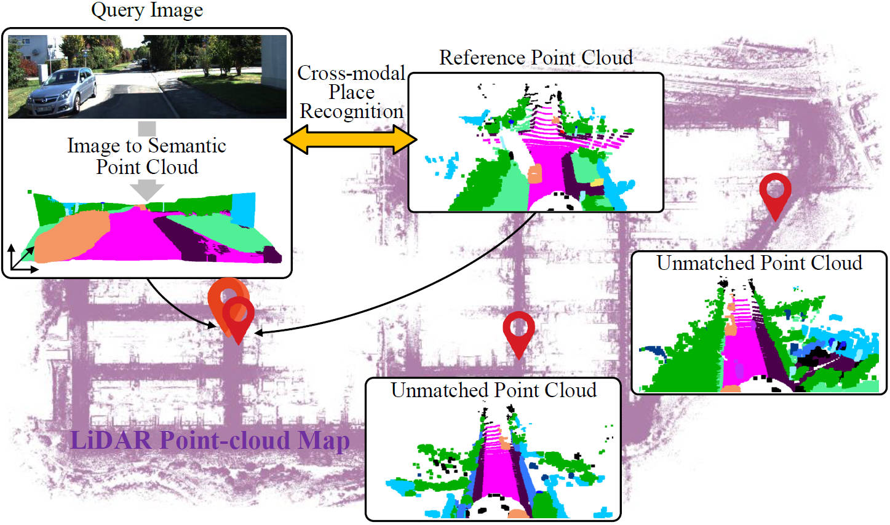
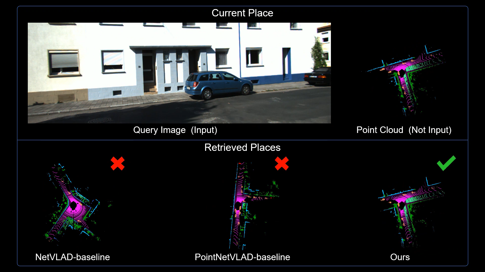

# C2L-PR
The official implementation of [C2L-PR: Cross-modal Camera-to-LiDAR Place Recognition via Modality Alignment and Orientation Voting](https://ieeexplore.ieee.org/document/10586273).

This work has been accepted by IEEE T-IV 2024. tada:
[Huaiyuan Xu](https://scholar.google.com.hk/citations?user=kpMGaNIAAAAJ&hl=zh-CN); [Huaping Liu](https://scholar.google.com.hk/citations?user=HXnkIkwAAAAJ&hl=en); [Shoudong Huang](https://scholar.google.com/citations?user=DMsPWz0AAAAJ&hl=zh-CN); [Yuxiang Sun](https://scholar.google.com.hk/citations?user=CuCSzQQAAAAJ&hl=zh-TW)


## Overview
<p align='center'>

</p>
The figure illustrates our idea of cross-modal place recognition with a visual image against a pre-built LiDAR point-cloud database. Given an on-line query image captured by a vehicle-mounted monocular camera, a semantic point cloud is generated from the image to alleviate the modality gap to find the matched reference point cloud in the database.

[](https://www.youtube.com/watch?v=60S9BFzgWI0)


Demo video (best viewed in 1080p quality): https://www.youtube.com/watch?v=60S9BFzgWI0


## Get Started

### Installation and Data Preparation

step 1. Please prepare environment as that in [Docker](docker/Dockerfile).
```shell script
$ cd docker
$ docker build -t your_docker_image .
$ docker run -it --shm-size 8G -p 1001:6006 -p 1000:22 --ipc host --name your_docker_container --gpus all -v ~/your_project_direction:/workspace your_docker_image  /bin/bash 
```

step 2. Prepare C2L-PR repo by.
```shell script
$ git clone https://github.com/lab-sun/C2L-PR.git
$ cd C2L-PR
```

step 3. Download [data](https://drive.google.com/file/d/1DQ39oxOrWrbMlzw9aoMOvJjG_LHx3F_i/view?usp=sharing) and [checkpoints](https://drive.google.com/file/d/129CXejzM5RVk82RSPNkv8fH_U3F0bJQ3/view?usp=sharing). Then arrange the folder as:
```shell script
C2L-PR/
├── checkpoints
├── data
    └── kitti 
        ├── 0
        ├── 1
        ├── 2
        ├── 3
        ├── 4
        ├── 5
        ├── 6
        ├── 7
        ├── desc_image
        ├── gt_split90
        ├── pairs_kitti
        └── pose_kitti
├── docker
└── images
    ...
```
## Train models
In train.py, please modify os.environ['CUDA_VISIBLE_DEVICES'], pointing to a specifc graphic card. Please modify directions of 'gt_folder','velo_desc_folder_0' to '7', and 'img_desc_folder', appropriately.
Then, run the following command:
```shell
$ sh train.sh
```

## Evaluate models
In eval_f1.py, please modify os.environ['CUDA_VISIBLE_DEVICES'].
In eval_f1.sh, please modify '--model', '--velo_desc_file_0' to '7', '--img_desc_file', '--pairs_file', appropriately.
```shell
# Evaluate place recognition. We take F1 score as the metric.
$ sh eval_f1.sh
# Evaluate loop closure. We take recall@K as the metric.
$ sh eval_recall.sh
```

## Acknowledgement

We thank the fantastic work [RINet](https://github.com/lilin-hitcrt/RINet) for its pioneer code release, which provide codebase for C2L-PR.


## Citation
If you use C2L-PR in an academic work, please cite our paper:

    @ARTICLE{10586273,
    author={Xu, Huaiyuan and Liu, Huaping and Huang, Shoudong and Sun, Yuxiang},
    journal={IEEE Transactions on Intelligent Vehicles}, 
    title={C2L-PR: Cross-modal Camera-to-LiDAR Place Recognition via Modality Alignment and Orientation Voting}, 
    year={2024},
    volume={},
    number={},
    pages={1-17},
    doi={10.1109/TIV.2024.3423392}}

 

## Contact
huaiyuan.xu@polyu.edu.hk

Website:  [https://www.labsun.org/](https://www.labsun.org/)
